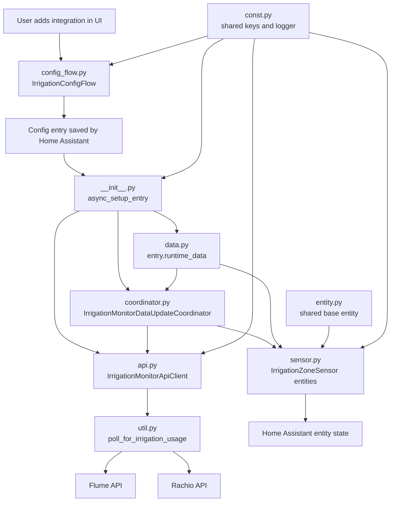

# Irrigation Monitor

Custom Home Assistant integration that polls Flume and Rachio to estimate irrigation water usage per zone.

## What This Component Does

At a high level, the integration tries to answer this question: "When Rachio says a zone watered recently, how much water did Flume measure during that same time window?"

The component combines two data sources:

1. Rachio tells it which zones watered, when they started, and when they stopped.
2. Flume tells it how much water flowed during those time ranges.

The final result is a per-zone report that Home Assistant exposes as sensor entities.

## Getting Started
You will need to enter several credentials upon first-time setup:
- Flume Username: Username for your Flume account
- Flume Password: Password for your Flume account
- Flume Client ID: You need to sign in to your Flume account, go to Settings > API Access, then click `Generate API Client` to see your Client ID. [See Overview section in these docs.](https://flumetech.readme.io/docs/authentication)
- Flume Client Secret: When you generate your API client, you will be able to see your client secret as well. [See Overview section in these docs.](https://flumetech.readme.io/docs/authentication)
- Rachio API Token: Log in to Rachio, go to Profile > API Key to get your API key. [Docs](https://rachio.readme.io/reference/authentication)
- Flume Device Index (optional): Only relevant if you have multiple Flume devices; use this to specify which device to use.

## Entity Guide

The integration now creates several sensor types from the same per-zone report.
They serve different jobs, and they are intentionally not interchangeable.

### Per-zone entities

For each irrigation zone, the integration creates:

1. `last watering event`: timestamp of the latest watering start time for that zone
2. `water used`: gallons measured for the latest watering event
3. `total water used`: cumulative gallons observed for that zone over time

The `last watering event` sensor is mainly an event marker. It is useful for:

1. detecting that a new watering event happened even if two events use the same number of gallons
2. automations that should react when a new irrigation cycle is observed
3. debugging deduplication, because each event has a stable `event_id`

The `water used` sensor is the best fit for graphing usage per watering event.

The `total water used` sensor is the dashboard-oriented sensor for each zone. It
is a cumulative water sensor that only increments when a newly observed event is
seen for that zone.

### Whole-system entity

The integration also creates one aggregate sensor:

1. `Irrigation total water used`: cumulative gallons observed across all zones

This is the simplest entity to use if you want one irrigation number for the
Home Assistant water dashboard.

### Default visibility

Some sensors are disabled by default to keep the entity list usable:

1. the per-zone `last watering event` sensor
2. the whole-system `Irrigation total water used` sensor

They remain available in the entity registry and can be enabled if you want
them.

### Important limitation

Rachio only exposes the latest watering record per zone. Because of that, this
integration can only count the most recently reported event for each zone at
poll time. If multiple watering events happen for the same zone between
successful polls, older ones cannot be recovered.

## Architecture Diagram



Installation

1. Copy the `irrigation_monitor` folder into your Home Assistant `custom_components` directory: `config/custom_components/irrigation_monitor`.
2. Restart Home Assistant.

Configuration

Use the UI: after installing the `irrigation_monitor` folder in `custom_components`, restart Home Assistant and add the integration via Settings -> Devices & Services -> Add Integration -> search for "Irrigation Monitor". The config flow will ask for the Flume and Rachio credentials.

Secrets

Do not store API tokens in repository files. Use Home Assistant's Secrets (`secrets.yaml`) or the integration UI to store credentials. The repository files in this project have been redacted; replace secrets via the UI or `secrets.yaml` only.

Notes

- This integration now uses a DataUpdateCoordinator to share polling results across sensors. It's still a lightweight prototype — a production-ready integration should add reauthentication and more robust error handling.
- If you'd like, I can add unit tests and CI next.

## Runtime Walkthrough

If you are new to Home Assistant components, the easiest way to understand this one is to follow the runtime path from setup to sensor state.

### 1. The config flow collects credentials

The setup starts in [config_flow.py](./config_flow.py). When you add the integration in the UI, Home Assistant instantiates `IrrigationConfigFlow`.

That class:

1. shows the form fields for Flume and Rachio credentials
2. calls the API client to validate those credentials
3. creates a config entry if validation succeeds

The config entry is the saved configuration record Home Assistant will load on startup.

### 2. Home Assistant loads the config entry

Once the entry exists, Home Assistant calls [__init__.py](./__init__.py), specifically `async_setup_entry`.

That function creates the shared runtime objects for the integration:

1. `IrrigationMonitorApiClient`: wrapper around the lower-level data-fetching code
2. `IrrigationMonitorDataUpdateCoordinator`: refresh scheduler and shared cache
3. `IrrigationMonitorData`: typed container stored in `entry.runtime_data`

It then performs the first refresh and forwards setup to the sensor platform.

### 3. The coordinator fetches shared data

The coordinator lives in [coordinator.py](./coordinator.py). Its `_async_update_data` method is the standard Home Assistant hook for "fetch fresh data now".

Instead of every entity making its own API requests, the coordinator fetches one shared report and stores it in `coordinator.data`. That is the recommended Home Assistant pattern when many entities depend on the same external data.

### 4. The API client bridges Home Assistant and the raw helper code

The coordinator calls into [api.py](./api.py). The `IrrigationMonitorApiClient` does two important things:

1. it runs the synchronous polling logic in an executor so Home Assistant's event loop is not blocked
2. it translates low-level failures into integration-specific exceptions

That keeps Home Assistant-facing code cleaner than calling the raw helper functions directly.

### 5. The raw data pipeline lives in util.py

Most of the vendor-specific logic is in [util.py](./util.py). The main function is `poll_for_irrigation_usage`.

That function does the real work:

1. logs into Flume and gets the selected monitor
2. logs into Rachio and gets recently watered zones
3. builds one Flume query per watered zone
4. downloads the Flume readings for those windows
5. aggregates the results into gallons and minutes per zone
6. merges the measured Flume data with the Rachio zone metadata

The output is a list of structured `WaterReportDataPoint` objects, one per
zone.

### 6. The sensor platform turns report rows into entities

After the coordinator has data, Home Assistant calls [sensor.py](./sensor.py).
The `async_setup_entry` function loops over the report rows and creates several
sensors per zone plus one whole-system total sensor.

The current sensor set is:

1. a per-zone timestamp sensor for the latest watering event
2. a per-zone gallons-used sensor for the latest watering event
3. a per-zone cumulative gallons sensor for dashboard-style totals
4. a whole-system cumulative gallons sensor across all zones

All of them read from the shared coordinator cache instead of fetching their own
data, so one coordinator refresh updates the whole entity set consistently.

### 7. Shared entity metadata lives separately

The base entity class in [entity.py](./entity.py) is where shared Home Assistant entity behavior goes, such as device registry metadata and attribution.

As the integration grows, that file is the right place for behavior that should be common across multiple entity types.

### 8. Shared constants and runtime typing support the rest

[const.py](./const.py) centralizes the domain name, config keys, logger, and attribution text. [data.py](./data.py) defines the runtime data object stored on the config entry.

These modules do not do much at runtime, but they make the rest of the component easier to reason about and safer to refactor.

## Mental Model

If you want one short mental model for the whole component, use this:

1. `config_flow.py` gathers and saves credentials.
2. `__init__.py` creates the long-lived runtime objects.
3. `coordinator.py` refreshes one shared report.
4. `api.py` wraps the polling call and normalizes errors.
5. `util.py` talks to Flume and Rachio and builds the report.
6. `sensor.py` exposes each report row as several Home Assistant entities with
	different jobs: event marker, per-event usage, and cumulative totals.

## One Refresh Cycle

This section follows one normal refresh cycle after the integration has already been configured and loaded.

### Step 1: Home Assistant loads the config entry

Home Assistant calls `async_setup_entry` in [__init__.py](./__init__.py).

That function:

1. creates `IrrigationMonitorDataUpdateCoordinator`
2. creates `IrrigationMonitorApiClient`
3. stores both in `entry.runtime_data`
4. calls `await coordinator.async_config_entry_first_refresh()`

That fourth step is what kicks off the first real fetch.

### Step 2: The coordinator starts a refresh

Home Assistant enters `_async_update_data` in [coordinator.py](./coordinator.py).

This method is the coordinator hook that says, effectively, "get the newest shared data now."

Its main call is:

```python
return await self.config_entry.runtime_data.client.async_get_data(self.hass)
```

So the coordinator itself does not know anything about Flume or Rachio. It only knows which client should provide fresh data.

### Step 3: The API client moves synchronous work off the event loop

Inside [api.py](./api.py), `async_get_data` receives the Home Assistant instance and calls:

```python
return await hass.async_add_executor_job(poll_for_irrigation_usage, ...)
```

That is an important Home Assistant pattern.

The code in [util.py](./util.py) uses `requests` and pandas, which are synchronous. Running that work directly in async code would block Home Assistant's event loop. `async_add_executor_job` pushes it to a worker thread instead.

### Step 4: The raw polling pipeline starts in util.py

The worker thread enters `poll_for_irrigation_usage` in [util.py](./util.py).

This is the real center of the data pipeline. It executes in this order:

1. create a `FlumeClient`
2. choose a Flume monitor with `flume_client.monitors[flume_device_index]`
3. create a `RachioClient`
4. call `get_last_watered_summary(...)` to get recent zone watering windows
5. call `_create_query_list(...)` to build one Flume query per zone
6. call `query_usage(...)` to fetch Flume readings for those windows
7. aggregate minute-level readings with `_summarize_watering`
8. merge the Flume totals with the Rachio zone summary

The result is returned as a list of `WaterReportDataPoint` objects.

### Step 5: Flume authentication and device discovery happen first

When `poll_for_irrigation_usage` constructs `FlumeClient`, the `FlumeClient.__init__` path immediately does three things:

1. `_get_flume_access_token()`
2. `_get_user_id()`
3. `_get_my_flume_info()`

That means Flume authentication and device discovery happen up front, before any Rachio calls or usage queries.

After that, the code selects one monitor from `flume_client.monitors` using the configured device index.

### Step 6: Rachio provides the time windows

Next, `RachioClient(token=rachio_token)` resolves the person ID, and `get_last_watered_summary(...)` walks through the Rachio zones.

For each enabled zone, `_get_last_water_time_for_zone(...)` builds a normalized row containing fields like:

1. `zone_id`
2. `zone_name`
3. `last_watering_start_time`
4. `last_watering_stop_time`
5. estimated gallons and other metadata

At this stage, the integration knows when each zone watered, but not yet how much measured water Flume saw.

### Step 7: The integration converts watering windows into Flume queries

`_create_query_list(...)` takes the Rachio summary rows and turns them into a list of Flume query payloads.

Each query uses a zone name as its `request_id`, plus a start and end time window. That is how the integration later matches Flume readings back to the correct zone.

### Step 8: Flume usage readings are aggregated per zone

`query_usage(...)` sends the Flume queries and returns the summarized Flume
usage results matched back to the request ids for each zone.

Then `poll_for_irrigation_usage` merges those measured totals with the Rachio
watering metadata and builds one `WaterReportDataPoint` per zone.

That is the point where raw vendor responses become entity-friendly summary
data.

### Step 9: The merged report comes back through the stack

The final merged irrigation report returns from [util.py](./util.py) to
[api.py](./api.py), then to [coordinator.py](./coordinator.py).

The coordinator stores that list of `WaterReportDataPoint` objects as
`coordinator.data`.

From that point on, every sensor entity can read the same shared snapshot.

### Step 10: The sensor platform creates or updates entities

During first setup, [sensor.py](./sensor.py) reads `entry.runtime_data.coordinator.data` inside `async_setup_entry`.

It loops over the DataFrame rows and creates one `IrrigationZoneSensor` per zone.

Each sensor stores only enough identity to find its own row later:

1. `zone_name`
2. `zone_id`
3. a generated unique ID

The sensor does not keep its own copy of the fetched data.

### Step 11: Each sensor resolves its current row on demand

When Home Assistant asks a sensor for its state, `IrrigationZoneSensor.native_value` calls `_report_row`.

`_report_row` looks inside `self.coordinator.data` and selects the matching row by `zone_id` when available, otherwise by `zone_name`.

Then:

1. `native_value` returns `total_gallons`
2. `extra_state_attributes` returns the whole row as attributes

So the entity state is always derived from the coordinator's latest cached DataFrame.

### Step 12: Later refreshes reuse the same entity objects

After setup, Home Assistant does not recreate all the sensors on every poll. Instead, the coordinator refreshes `coordinator.data`, and the existing entities see updated values the next time Home Assistant reads their properties.

That is why the coordinator pattern matters: one fetch updates every zone sensor consistently.

## Practical Debugging Guide

When something breaks, this is a useful way to narrow it down:

1. If the integration cannot be added in the UI, start in [config_flow.py](./config_flow.py).
2. If the config entry loads but no data appears, check [__init__.py](./__init__.py) and [coordinator.py](./coordinator.py).
3. If authentication or polling fails, inspect [api.py](./api.py).
4. If the reported gallons or zone matching look wrong, inspect [util.py](./util.py).
5. If data exists but entities look wrong in Home Assistant, inspect [sensor.py](./sensor.py) and [entity.py](./entity.py).
